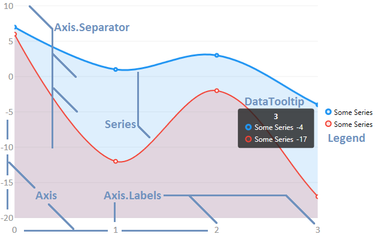
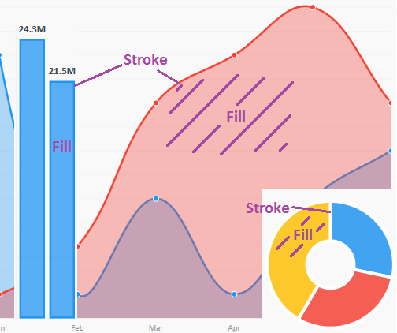

# Components

The next image illustrates the components of the `CartesianChart` object and will guide you to get familiar with all the charts components.

## Series

A Series is a generic collection of data, every series type defines the result in the user interface, in the image above we are seeing 2 `LineSeries` objects, one is blue, the second is red, all the series have a `Stroke` and `Fill` properties.

If you don't set the color of your series, the library will set them for you according to the position of each series in the `Chart.Series` property, the colors will repeat if necessary.

Use the `Series.Visibility` property to hide/show any series, use the `ZIndex` property to indicate the position of the series in the Z index (in a 2d chart).

## Data Tool Tips

A DataTooltip displays extra information for the user every time he interacts with a point, for example in a Desktop chart, when he places the mouse over a point a tooltip will appear and will let the user know more information about it, you can customize any tooltip to display as much information as your users require, see ${link, the tooltips section, docs/getting started/tooltips}.

## Legends

A legend displays the series in the `Chart.Series` collection property, letting the user know what we are comparing at the current chart, Legends are also customizable and you can display anything you require in them, see ${link, legends section, docs/getting started/legends} for more information.