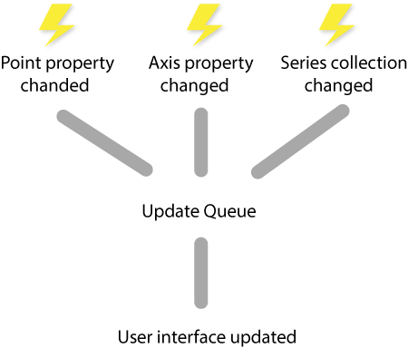

# Automatic updates

LiveCharts updates and animates automatically as your data changes, we listen for `INotifyPropertyChanged` or `INotifyCollectionChanged` implementations, the chart control registers a handler at many components it uses, that will enqueue an update when a property or a collection changes, finally when the resource is removed from the chart, the handler is also gone from the instance.

As you probably noticed we said 'enqueue an update', this means that the charts in not redrawn every time a property or a collection changes, redrawing the UI specially in a charting library when we could have millions of objects could be a expensive task.



The previous diagram simulates 3 events, a point property changed, an axis property changed, and finally we added a new series to our chart, every event will notify the queue, when the first event occurred, the queue already knows it has to send an update to the UI, but before sending it, the queue will listen for a defined interval of time for more changes in our chart, once the interval is finished, the update will be sent to the UI, all this was done by the core of the library, now each consumer of the core (WPF, UWP, Xamarin) will behave different and draw/animate the requested shapes in the UI.

The objects defined by LiveCharts are ready to notify the chart for an update, but what about the user defined variables? it is optional for the user to decide whether the chart will attach the update handler, while your objects implement `INotifyPropertyChanged` or `INotifyCollectionChanged` the chart will attach the handler.

## Collection changed

The `Chart.Series` is of type `IEnumerable<Series>` and an axis of a chart is of type `IList<Plane>`, if any of those properties implement `INotifyCollectionChanged` then LiveCharts will attach a handler to notify for an update when the collection changes.

In the next samples, we are using the `Chart.Series` property, but axes work the same way.

The next block will not update when the collection changes because we are setting an array of `Series`, and `Array` does not implements `INotifyCollectionChanged`, but this scenario could also be useful if you don't need automatic updates.

```c#
var chart = new CartesianChart();
chart.Series = new Series[]
{
    new LineSeries<double>(),
    new BarSeries<double>()
};
```

The .Net framework provides the `ObservableCollection` class ([see the docs](https://msdn.microsoft.com/en-us//library/ms668604(v=vs.110).aspx)), this collection already implements `INotifyCollectionChanged`, thus every time our collection changes in the next snippet, the chart will be automatically updated.

```c#
var chart = new CartesianChart();
var seriesCollection = new ObservableCollection<Series>
{
    new LineSeries<double>(),
    new BarSeries<double>()
};
chart.Series = seriesCollection;

// the chart will draw any new series that is added to our seriesCollection instance
seriesCollection.Add(new ScatterSeries<double>())
```

Even you can decide the type of the instance to store your series or axes, we recommend you to use the `ChartingCollection<T>` class, the problem with `ObservableCollection` is that it does not support to add or remove a range of values, sadly in our library this is a vital feature that improves performance, `ChartingCollection<T>` class inherits from `ObservableCollection` and then implements `INotifyRangeChanged` (an interface that exists only in LiveCharts), this interface adds the `AddRange` and `RemoveRange` methods and `ChartingCollection<T>` is optimized for our library.

```c#
var chart = new CartesianChart();
chart.Series = new ChartingCollection<Series>
{
    new LineSeries<double>(),
    new BarSeries<double>()
};
// the chart will draw any new series that is added to our seriesCollection instance
seriesCollection.Add(new ScatterSeries<double>())
// we can also add multiple series at once.
seriesCollection.AddRange(new Series[]
{
    new ScatterSeries<double>(),
    new ScatterSeries<double>()
});
```

## Property Changed

As you noticed the `Series` derived classes are generic, this way we can plot anything in our charts, but we have to teach the library how to do so, if you wantg to learn more about how to teach the library to plot a custom type, please see ${link, custom types section, docs/getting started/custom types}.

In this sample we will generate a chart to build a chart that displays our students data base, we want to compare the `Age` property in a bar chart.

```c#
public class Student
{
    public Guid Id { get; set; }
    public int Age { get; set; }
}
```

we teach the library to map a student to a coordinate in a chart:

```c#
Charting.Settings(charting =>
{
    charting.LearnType<Student>(
    (student, index) => new LiveCharts.Core.Coordinates.Point(index, student.Age));
});
```

Now we are able to build our chart:

```c#
var chart = new CartesianChart();

var seriesCollection = new ChartingCollection<Series>();
chart.Series = seriesCollection;

var ageSeries = new BarSeries<Student>();

ageSeries.Add(new Student
{
    Age = 22,
    Name = "Charles"
 });
    ageSeries.Add(new Student
{
    Age = 25,
    Name = "Frida"
});

seriesCollection.Add(ageSeries);
```

You should see a bar chart displaying a bar for Charles and one for Frida, displaying 22 and 25 respectively.

If the age property changes the chart won't refresh for now, if we want automatic updates our `Student` class must implement `INotifyPropertyChanged`:

```c#
public class Student : INotifyPropertyChanged
{
    private int _age;

    public string Name { get; set; }

    public int Age
    {
        get { return _age; }
        set
        {
            _age = value;
            OnPropertyChanged();
        }
    }

    public event PropertyChangedEventHandler PropertyChanged;

    protected virtual void OnPropertyChanged([CallerMemberName] string propertyName = null)
    {
        PropertyChanged?.Invoke(this, new PropertyChangedEventArgs(propertyName));
    }
}
```

Now every time the Age property changes, our `Student` class will notify to all the subscribers that a property changed, therefore our chart will be able to redraw every time the Age property changes.